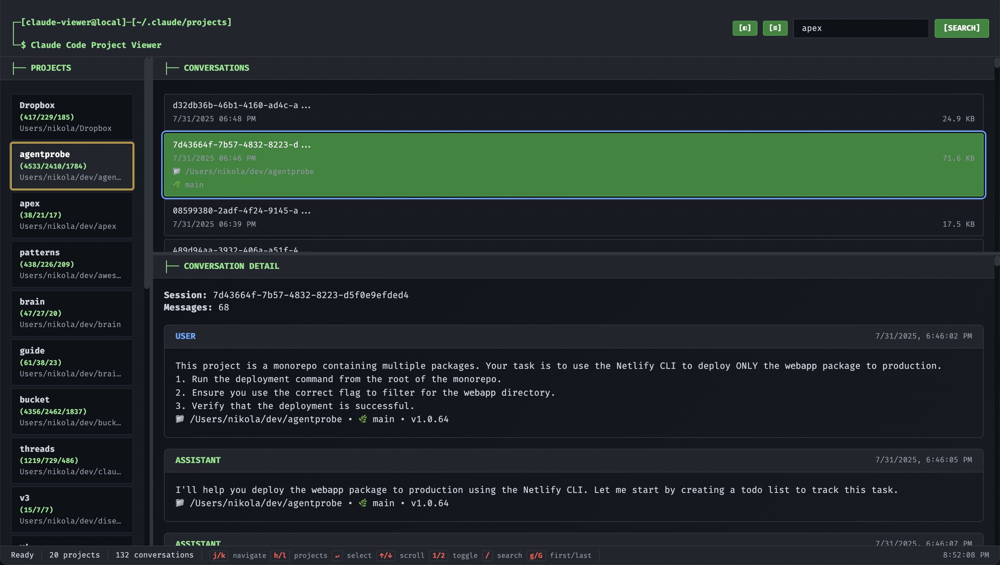

# Claude Threads Viewer

[](https://opensource.org/licenses/MIT)
[](https://nodejs.org/)
[](https://developer.mozilla.org/en-US/docs/Web/JavaScript)
[](CONTRIBUTING.md)

A lightweight web viewer for Claude Code conversation files with a terminal-inspired ASCII aesthetic. Browse and search through your Claude Code projects and conversations in a clean, vim-style interface.



## Features

- 🗂️ **Project Browser**: Navigate through projects from `~/.claude/projects`
- 💬 **Conversation Viewer**: View JSONL conversation files in expandable format
- 🔍 **Full-Text Search**: Search across all conversations with result highlighting
- ⌨️ **Vim-Style Navigation**: Use j/k/h/l keys for keyboard navigation
- 🎨 **Terminal Aesthetic**: GitHub Dark theme with ASCII art styling
- 📱 **Responsive Design**: Works on desktop and mobile devices
- 🔧 **Tool Call Highlighting**: Syntax highlighting for code blocks and tool calls
- 🧠 **Thinking Blocks**: Expandable internal reasoning sections

## Quick Start

```bash
# Install dependencies
npm install

# Start the development server
npm start
# or
npm run dev

# Open your browser to http://localhost:3000
```

## Keyboard Shortcuts

| Key | Action |
|-----|--------|
| `j/k` | Navigate conversations (up/down) |
| `h/l` | Navigate projects (left/right) |
| `Enter` | Select highlighted item |
| `1/2` | Toggle sidebar/conversations panels |
| `/` | Focus search box |
| `g/G` | Go to first/last item |
| `Escape` | Clear selection |

## Requirements

- Node.js 14+
- Access to `~/.claude/projects` directory
- Modern web browser with ES6 support

## Usage


1. **Browse Projects**: Click on projects in the left sidebar or use `h/l` keys
2. **View Conversations**: Click on conversations or use `j/k` keys to navigate
3. **Expand Messages**: Click on conversations to view detailed message threads
4. **Search**: Use the search box (`/` key) to find specific text across all conversations
5. **Expand Tool Calls**: Click on tool calls and thinking blocks to expand details
6. **Toggle Panels**: Use `1/2` keys to hide/show sidebar and conversations panels

## Project Structure

```
claude-threads/
├── server.js              # Express server (~400 lines)
├── public/
│   ├── index.html         # Single-page application shell
│   ├── app.js            # Frontend application (~800 lines)
│   └── style.css         # Terminal styling
├── SPECS.md              # Technical specification
├── CLAUDE.md             # Development instructions
└── README.md             # This file
```

## Architecture

### Three-Tier Structure
- **Backend** (`server.js`): Express server that scans Claude projects and serves JSONL files
- **Frontend** (`public/app.js`): Single-page vanilla JavaScript application
- **Styling** (`public/style.css`): Terminal-inspired design with GitHub Dark theme

### Key Components

**ClaudeViewer Class**: Main frontend controller handling:
- Project/conversation navigation with keyboard shortcuts
- Panel toggle system (sidebar/conversations can be hidden)
- Message rendering with expandable sections
- Full-text search functionality

**Server API**:
- `/api/projects` - Returns projects with message statistics
- `/api/projects/:project/conversations` - Lists conversations with metadata
- `/api/projects/:project/conversations/:file` - Returns parsed JSONL messages
- `/api/search?q=term` - Full-text search with result limiting

## Development

### Local Development
- Server auto-serves static files from `public/`
- No build process required - uses vanilla HTML/CSS/JS
- Manual browser refresh needed for changes
- Console logging enabled for debugging

### Performance Notes
- Stats calculation can be slow with many large conversations
- Search limited to 100 results to prevent memory issues
- Large files (>25MB) may cause browser performance problems

## Security

- Read-only file system access limited to `~/.claude/projects`
- Path traversal prevention with basename validation
- Content escaping for XSS prevention
- File size limits for conversations and scanning

## Contributing

Please read [CONTRIBUTING.md](CONTRIBUTING.md) for details on our code of conduct and the process for submitting pull requests.

## License

This project is licensed under the MIT License - see the [LICENSE](LICENSE) file for details.

## Acknowledgments

- Inspired by terminal interfaces and vim navigation
- Built for the Claude Code ecosystem
- Uses GitHub Dark color palette